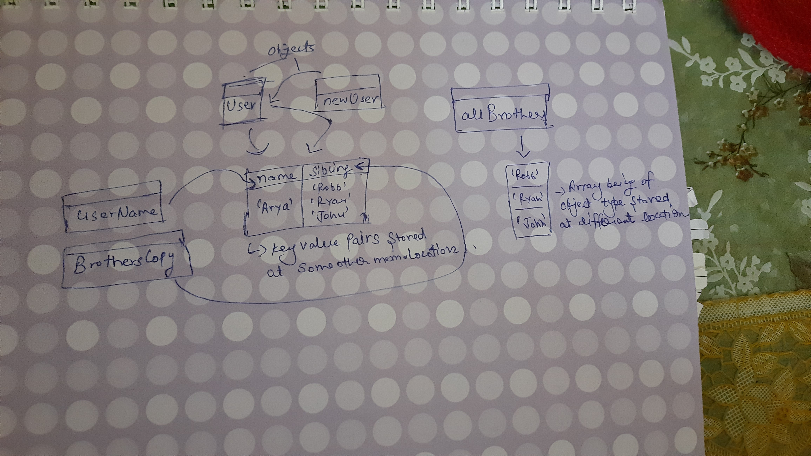

```js
let user = {
  name: 'Arya',
  sibling: ['Robb', 'Ryan', 'John'],
};
let allBrothers = ['Robb', 'Ryan', 'John'];
let brothersCopy = user.sibling;
let usename = user.name;
let newUser = user;
```

1. Memory representation

- Create the memory representation of the above snippet on notebook.
- Take a photo/screenshot and add it to the folder `code`



2. Answer the following with reason:

- `user == newUser;` // true as the two are objects and reference values from the same memory location
- `user === newUser;` // true both are of Object type thus with types equal as well as referencing the same memory location.
- `user.name === newUser.name;` // true both user.name and newuser.name are referenced from the same place 
- `user.name == newUser.name;` // true both are equal values
- `user.sibling == newUser.sibling;` // true again both are same values from same memory location
- `user.sibling === newUser.sibling;`//true again both are same values from same memory location and are of the same type
- `user.sibling == allBrothers;` // false both the arrays look identical but the array for allBrothers is located at a different memory location
- `user.sibling === allBrothers;` // false both the arrays look identical but the array for allBrothers is located at a different memory location
- `brothersCopy === allBrothers;` // false brothers copy is just the same as user.sibling
- `brothersCopy == allBrothers;` // false brothers copy is just the same as user.sibling 
- `brothersCopy == user.sibling;` // true both are same values referenced from the same memory address
- `brothersCopy === user.sibling;` // true both same values of same type from same memory location
- `brothersCopy[0] === user.sibling[0];` // true same array values
- `brothersCopy[1] === user.sibling[1];` // true same array values
- `user.sibling[1] === newUser.sibling[1];` // true both objects are referencing the same array.
