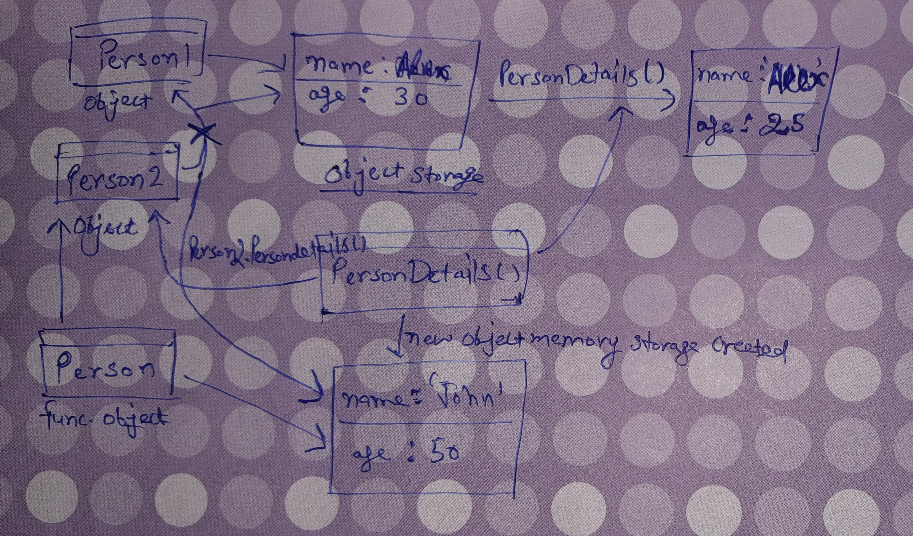

1. What will be the output and explain the reason.

```js
let obj = { name: 'Arya' };
obj = { surname: 'Stark' };
let newObj = { name: 'Arya' };
let user = obj;
let arr = ['Hi'];
let arr2 = arr;
```

Answer the following with reason after going through the above code:

- `[10] === [10]` // false as the two values on right and left are both arrays having one value and both of them reside in a different memory location thus can't be equal
- What is the value of obj? // {surname : 'Stark'} // we altered the value of obj with {surname : 'Stark'} from its original value.
- `obj == newObj` // false as obj has its own key:value pair and newObj has its own they may look identical but are residing in different memory locations
- `obj === newObj` // false as obj has its own key:value pair and newObj has its own they may look identical but are residing in different memory locations
- `user === newObj` // false the object user is having the same object key:value memory location as obj but newObj has a different memory location for its object
- `user == newObj` // false the object user is having the same object key:value memory location as obj but newObj has a different memory location for its object
- `user == obj` // true  both the two objects use the same object and reference it from the same memory address so both are equal
- `arr == arr2` // true both the two objects use the same object and reference it from the same memory address so both are equal
- `arr === arr2` // true arr2 get the array copied by reference from arr thus they both are actually having the same array as their value so they are equal. 

2. What's will be the value of `person1` and `person2` ? Explain with reason. Draw the memory representation diagram.



```js
function personDetails(person) {
  person.age = 25;
  person = { name: 'John', age: 50 };
  return person;
}
var person1 = { name: 'Alex', age: 30 };
var person2 = personDetails(person1);
console.log(person1); { name: 'Alex', age: 25 }
console.log(person2); { name: 'John', age: 50 }
```
- The output of person1 comes out like this due to pass by reference in the function call in personDetails(person1); the function personDetails modify its key age with the value of 25  but then in the line person = { name: 'john', age: 50}; it assignes a completely new object to person which is returned so person now has a new object as its value i.e., {name : 'john', age: 50};. Also person1 == person2 will return false as we have changed the reference memory address for person2 to another object.

3. What will be the output of the below code:

```js
var brothers = ['Bran', 'John'];
var user = {
  name: 'Sansa',
};
user.brothers = brothers;
brothers.push('Robb');
console.log(user.brothers === brothers); //1. true
console.log(user.brothers.length === brothers.length); //2. true
```
